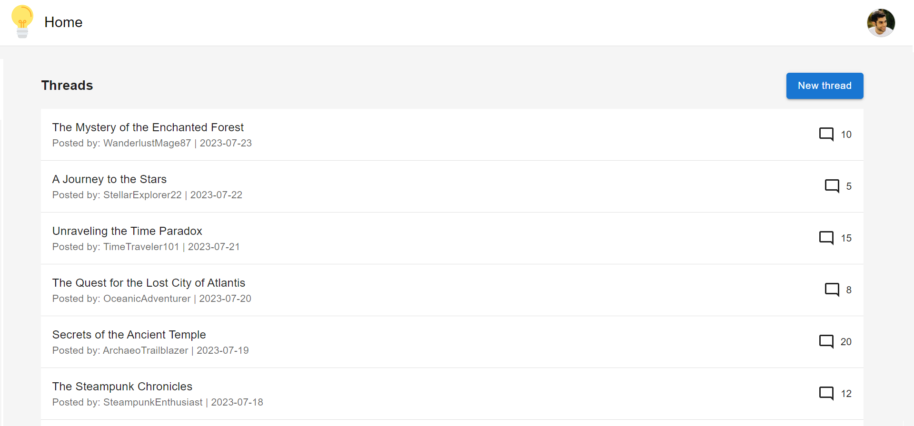

# Home

As a user,

I want to be able to see the main features right on the home page,

so that I can easily navigate to them.

## Home page acceptance criteria

As a signed-in user,

When I open the app, I immediately see the home page with the navbar and a list of threads.

I can click on any thread and be redirected to the thread view to see the details.

I can click on the New thread button and be redirected to the thread creation view.

I can click on my profile picture in the navbar and see the user menu.

I can click on the user name under the thread and be redirected to the user detail view.

### Wireframe

