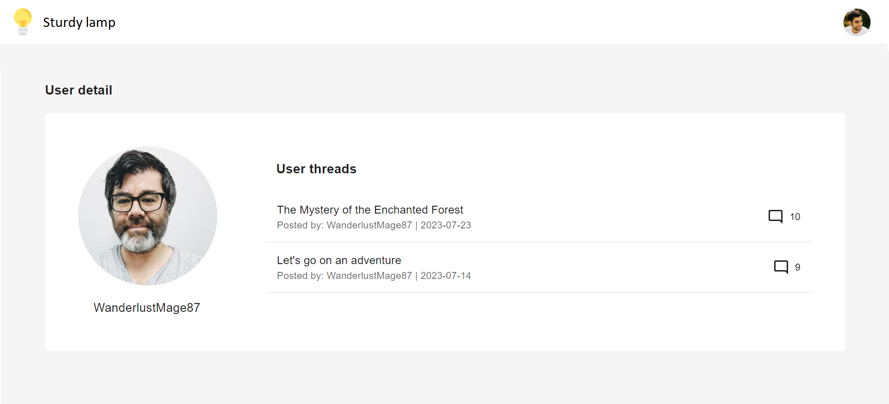
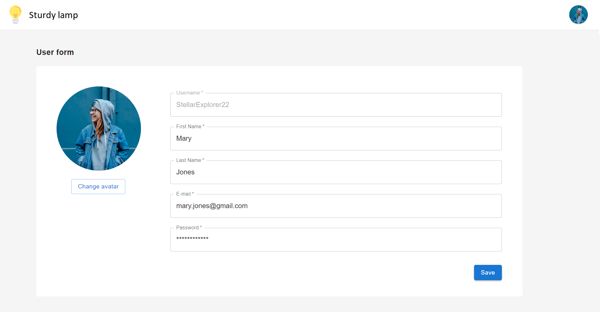

# Profile management

As a user,

I want to be able to check my profile detail, edit my profile, and check profile details of others to foster the sense of community.

## Profile management acceptance criteria

As an signed-in user,

When I click on a user name, I am redirected to the profile detail view, where I can see user's avatar and their threads.

I can open my own profile detail through user's menu if I click on my profile picture in the navbar.

In my own profile detail view, I can see an Edit button that redirects me to the edit user profile form view.

In the form I can edit all my data, except for the username.

### Wireframes

