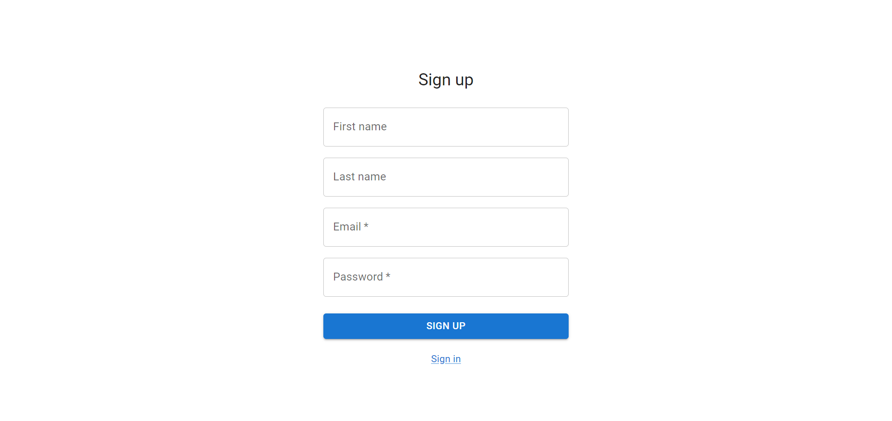
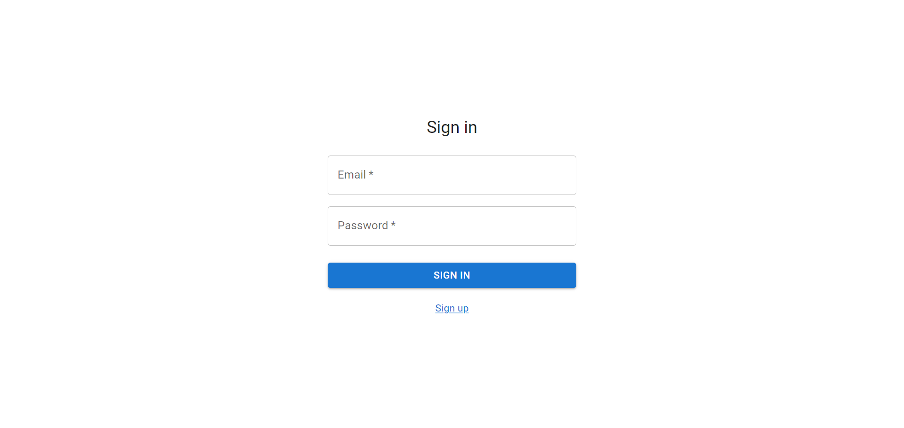

# Registration and authentication

As a user,

I want to be able to sign up, sign in, and sign out of the application,

so that I can securely access and manage my profile and posts.

## Sign-up acceptance criteria

As an unregistered user,

When I open the app, I see sign-in page with a link to sign-up page. As I click this link, I can see the sign-up form with a link back to the sign-in page.

I can enter my email and password (which are required), along with first and last name (both optional) into the sign-up form to create a new profile.

Upon successful registration, I am redirected to the sign-in page.

### Wireframe

## Sign-in acceptance criteria

As a registered user,

When I open the app, I see sign-in page if I'm not signed-in. If I am signed-in, I see the home.

I can enter my email and password to sign in.

Upon successful sign-in, I am redirected to the home page.

### Wireframe

